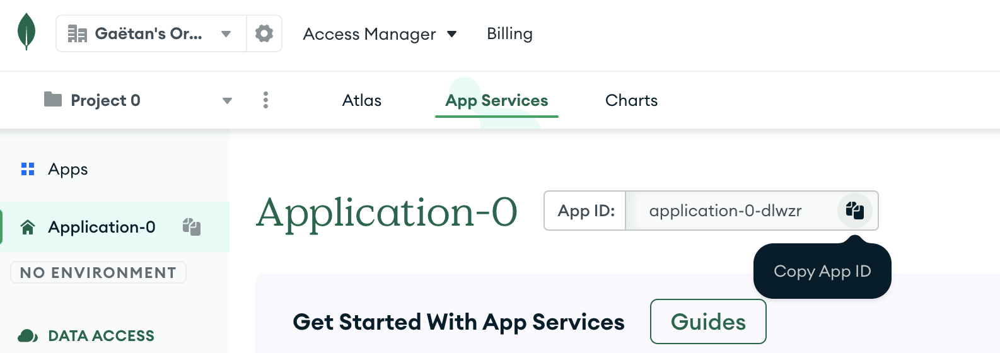

<h1 align="center">Welcome to Starter Kit Mongo Realm 👋</h1>
<p>
  
  <a href="#" target="_blank">
    
  </a>
</p>

> A starter kit for start with Mongo Realm

## Before Install

```sh
nvm use
```

## Install

```sh
npm ci
```

## Before commit and push

```sh
npm run build
```

## Before Getting Started
* Click on the button `Use Template` in [MONGODB-REALM-TYPESCRIPT-EXAMPLE](https://github.com/GaetanCottrez/MONGODB-REALM-TYPESCRIPT-EXAMPLE) and clone your fresh repository :

* Go to your app service in the menu Manage > Deployment and Tab Configuration :
  
* Follow the 4 steps : Install App Services on your GitHub, Authorize App Services Github App, Select your repository and enable Automatic Deployment

## Getting Started
You need to modify some value in different files :
* Change line 5 (`"clusterName": "<Name-Of-Your-Cluster>"`) in `data_sources/mongodb-atlas/config.json`. Adding the name of your cluster in Mongo Atlas. The name of your cluster is next to the button `Connect` : 

* Change line 2 (`"app_id": "<app-id>"`) in `realm_config.json`. Adding the ID of your application in App Services. You can copy the ID from your dashboard App Services :
  
* Change line 4 (`"name": "<name-of-application>"`) in `realm_config.json`. Adding the name of your application in App Services. You can found the name of your application from your dashboard (in my case is `Application-0`) :
  
* Change line 6 (`"provider_region": "<provider-region>"`) in `realm_config.json`. Adding your region where you have to deploy your App Service . You can found your region from the menu App Settings (in my case is `Ireland (eu-west-1) • AWS`, which give `aws-eu-west-1` ) :
  
* Commit and push your changement and after the deploy finish in App Service. You can see a new endpoint and a function `example` appear.

## Author

👤 **Gaëtan Cottrez <gaetan@apprendre-la-programmation.net>**

* Website: https://apprendre-la-programmation.net
* Github: [@GaetanCottrez](https://github.com/GaetanCottrez)
* LinkedIn: [@gaetan-cottrez](https://linkedin.com/in/gaetan-cottrez)

## Show your support

Give a ⭐️ if this project helped you!

<a href="https://www.buymeacoffee.com/GaetanCottrez"> </a>

***
